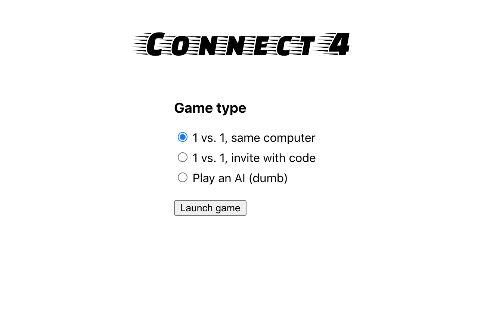
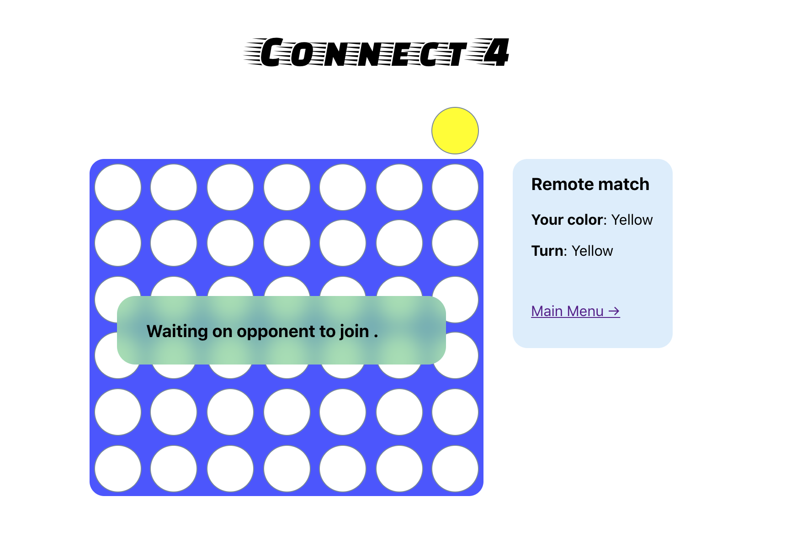
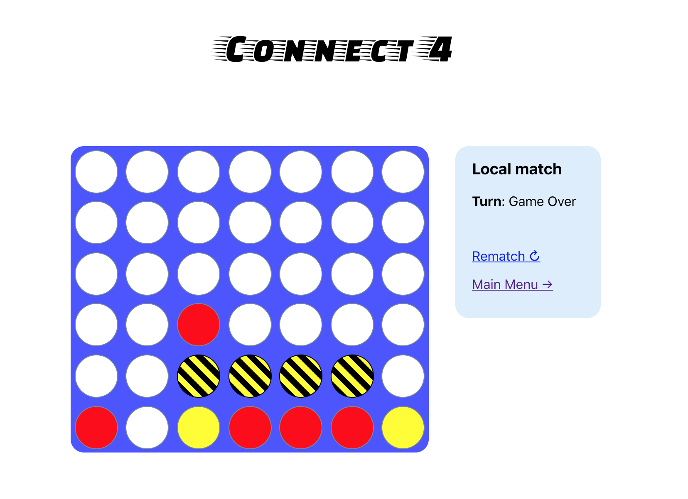

# Connect 4
A game primarily to teach myself more React and get some exposure to websockets.

## Screenshots

This repo was originally scaffolded using `create-react-app` and a second project was later added under `server/` to facilitate remote gameplay and host the client bundle. 

Note to future me: the build setup was not properly thought through, so to generate new, usable builds of the app, first create a production build of the top-level React project and then place the client bundle beneath `server/`.
